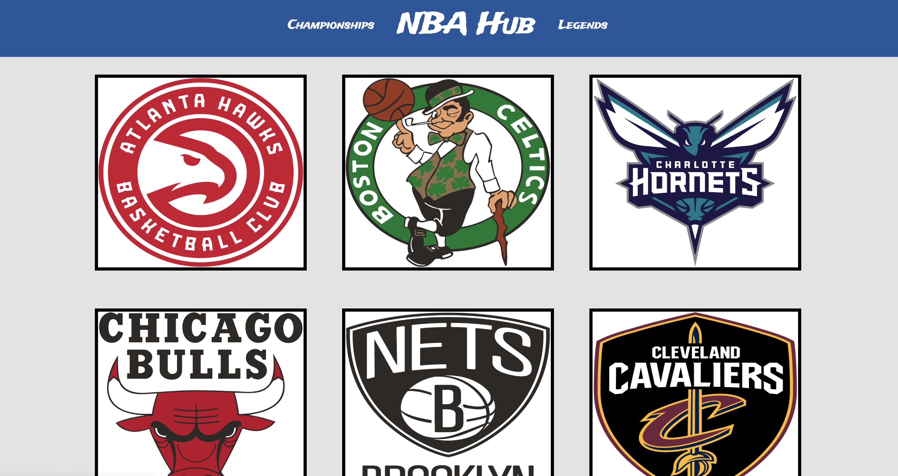
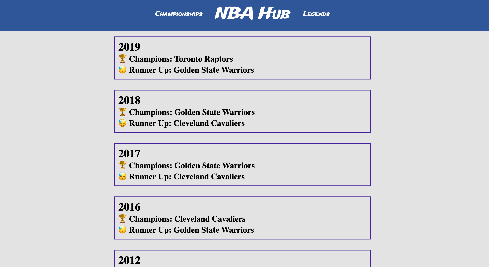
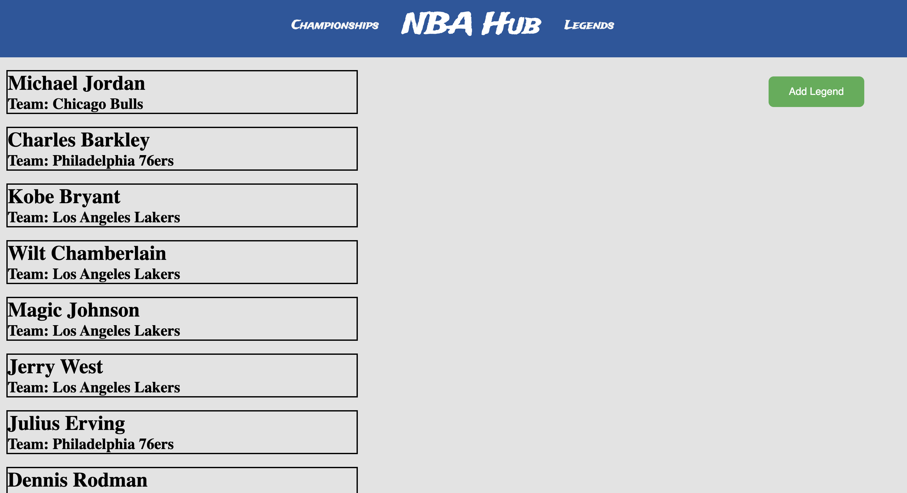
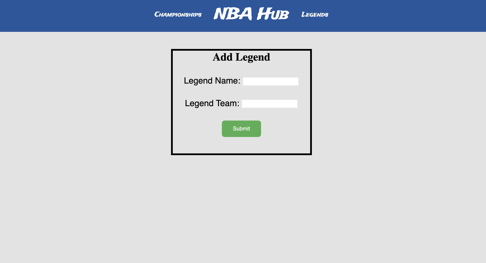

# NBA Hub
Fullstack (MERN Stack) web-app that uses an API that I created (NBA-Pi). Get the quickest synopsis on the NBA using NBA Hub! The site has information on every NBA team and is easy to navigate through. The site has create and read functionality through my API.

# API 
API Repository: https://github.com/natesanchez/NBA-Pi
API Live: https://nba-pi.herokuapp.com/ 

# Authors
Nate Sanchez

# Technologies Used
MongoDB
Express
React
Node.js